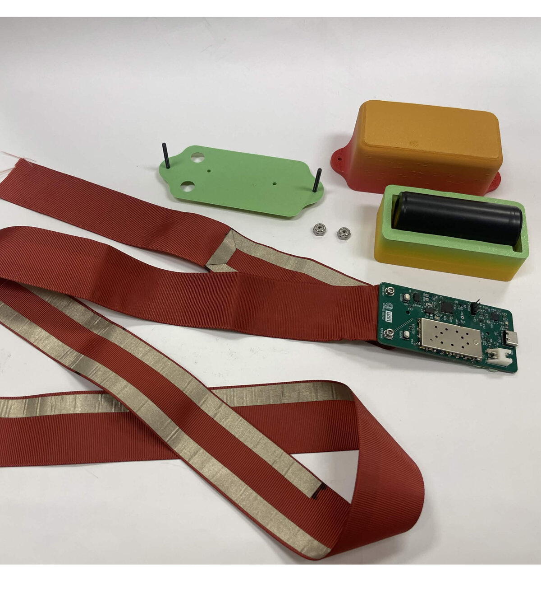

# A3 Beacon and Eggs

Hardware design files (KiCad 9) for the A3 recovery beacon — a VHF transmitter
stitched to the main recovery shock chord.

  

## Boards

### `Beacon_and_eggs/` — V1 (fabricated)

40 × 80 mm, 4-layer (F.Cu / GND / PWR / B.Cu).

- **MCU** — STM32F411CEU6 with 25 MHz and 32.768 kHz crystals, SWD header,
  boot/reset circuits, and test points
- **Radio** — SA868S / SA818V VHF module, UART control at 9600 baud, with
  TX_EN and TX_PWR_DN control lines and a TX audio input
- **Sensor** — ADXL343 accelerometer on I²C (ALT ADDRESS tied high → 0x1D)
- **Power** — BQ24070 Li-ion charger, USB-C input with ESD clamps, MIC5528
  3.3 V LDO, NTA4151P / NTA4153N load switches, and a divider for battery
  voltage monitoring on the ADC
- **Antenna** — plated mounting holes serve as the RF feed and ground clamp
  for a fabric antenna. 
- Status LEDs, battery connector, and an interactive BOM under `bom/`

### `Beacon_and_eggs_V2/` — in progress

A condensed second revision. Planned:

- Switch STM32F411 for a Pico
- No accelerometer
- Replace the SA868S module with a simple CW transmitter at 144 MHz, keyed
  directly from an Si5351A clock generator
- Smaller board as a result of all of the above -> smaller battery

WIP

### `Beacon BNC Adapter PCB/`

Two-connector coax breakout, used to attach a standard antenna or analyzer to
the beacon's bare antenna pads for bench testing.

## Firmware

Lives in the separate [A3_Beacon_and_Eggs_FW](https://github.com/zgsdlv/A3_Beacon_and_Eggs_FW)
repository (STM32CubeMX + HAL). It is bring-up code only, written to check that
the V1 hardware works - it reads the accelerometer's ID register, handshakes
with the SA868S, and blinks out which of the two responded.
